# DGL104 - Process Portfolio

 

## Author: Reeve Jarvis

 

---

## **Part 1:**

---

### **Week 1 Activities:**

---

 

#### **Activity 0101**:

> **Question:** Consider a recent programming project (perhaps from last semester) in which you either didn't know the answer to a problem, or you couldn't figure out how to solve a development issue you were facing. Revisit that code now, with fresh eyes, and reconsider the problem: Can you articulate exactly why this was a problem before? Is the solution any more evident? Use your README.md file to explain what the problem was and describe the strategies and resources you could use to solve it.

 

Towards the end of last semester we began to discuss recursion and implementing recursive solutions to problems we had previously approached in an iterative way. I found these recursive problems to be much more difficult to comprehend. One programming problem that stumped me was regarding a recursive method that conducts a binary search, but the method was limited to only two parameters: a String target, and an array of Strings. I struggled to find a solution that would return the intended results.

My primary issue was with properly adjusting the range of values I would be searching within, as after each binary search half of the possibilities are removed. Some thorough research on Stack Overflow and additional online resources led me to some possible solutions, however all of them used more parameters (representing the boundaries of the search) than the amount I was restricted to for my solution. I declared min, max, and mid variables to establish the boundaries of the search, however I was unable to figure out how to adjust these values appropriatly after each attempted search and maintain the integrity of my code. Due to time constraints and other course responsibilities I was unable to come to a successful solution.

Looking back now I feel that if I were to use Indirect Recursion, and write additional methods to establish the boundaries of the search that in turn call the initial method I may have been more successful. Though I was unable to complete this problem, I know that with some more research of code examples and time to explore this issue further I would come to a viable solution. I intend to explore recursion further, when time permits, to increase my understanding as I know it is an important aspect of programming.

---

 

#### **Activity 0102**:

 

> **Question:** Consider a recent programming project (perhaps from last semester). Open up the code and examine it for readability (as defined in the reading from Seriously Good Software). Use your README.md file to describe at least three potential areas of improvement, as per the reading from Serious Good Software.

 

Examining my code from last semester, there are definitely some areas for improvement when it comes to Readability.

**1. Commenting:**

In CPS100 we were constantly reminded to comment our intentions before we begin coding. This is something that I struggled to follow, and led to comments being added after I had finished coding. The resulting comments were far too descriptive and word-heavy, impeding the readability of my programs and causes unnecessary clutter. Updating my code would also require more work to update the comments accordingly. As described in the reading, it is best to be generous with documentation comments and stingy with implementation comments. I intend to work on following this guideline in the future, and keep the implementation comments to a minimum while addressing my intentions prior to coding.

**2. Loops:**

Another area of improvement I can extract from the reading, is in using the most appropriate loop for the situation. We worked on various dice games for one of our assignments, and in particular my solution for a game called Pig had a complicated series of nested loops. At the time I was more concerned with functionality rather than readability. I feel that with some further refactoring I could simplify my solution, reduce the amount of loops involved and improve the users understanding.

**3. Naming:**

Lastly, I could improve upon naming my variables. The above mentioned Pig game relied upon multiple variables to track data values between the player and computer. The names of some of these variables got a bit lengthy, and in some cases resulted in redundancies. With some refactoring, and simplifying my class down into more methods I could have avoided these redundancies and in turn improved readability by providing simplified names for the variables to be shared across both player and computer.

 

---

### **Week 2 Activities**

---

 

#### **Activity 0201:**

 

> **Question:** Consider the apps that you use regularly. Choose one app to asses based on the reading Usability Matters Ch. 2. Identify the values inherent to the app that might help to identify the target user base (a list is fine, but be descriptive). Briefly describe the target user base. Do your goals in using the app match those of the target user base?

 

One application I use frequently is Splitwise. The applications main function is to provide a conveinent way to track financial interactions and distribute costs between those involved. It is a free to download app, that provides extra features for an additional premium. With the premium version you can scan receipts, work with various currency conversions, and track the data in graphs.

Values inherant to the app include:

- Providing a simplified, modern way to track purchases and financials
- Ensuring accountability between those involved in financial interactions (making sure you are paid)
- Increasing overall organization and budgetting skills
- Saving users money by keeping up to date on finances
- Keeping you informed of your current costs to guide future spending habits

From the outlined values above it is apparent that this was an excellent app idea that serves a significant purpose. It provides a valuable service to its users and replaces a flawed alternative used in the past (IOU notes). The use cases vary accross many different subsets of people. The application can be used to track money you have lent a family member, those drinks you purchased for your friend because they forgot their wallet, or even your business expenses. In a way, the target user base can be considered as any adult with income. Personally, I use this application with my significant other to keep track of purchases we have been making and ensure we are each contributing a fair amount to our costs. I beleive that my goals in using the app match those of the intended user. As an adult, keeping track of your finances can be tough and I am using the app combat that.

---

 

#### **Activity 0203:**

 

> **Question:** Visit CodeWars.com and create a new account (if you don't already have one). Consider using a non-identifiable email address for privacy purposes. Choose Java as your default language and choose to either 'Train' on Java, or go to the Kata menu and choose an 8 kyu exercise from the list of exercises. Give your kata of choice a try (don't spend overlong on it, if you get stuck). Take a screenshot of your code when you are done (whether you've finished the kata or not) and post it to your Process Portfolio. Briefly describe whether or not you found the kata challenging, and what stopped you if you got stuck.

 

First of all, thank you for directing us towards codewars, I have had some fun figuring out problems and it is already increasing my understanding. After signing up I chose to train my Java skills and attempted an 8 kyu exercise.

| The Exercise:                            |
| ---------------------------------------- |
| 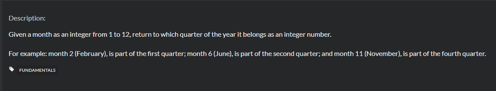 |

| My Solution: |
| ------------ |

|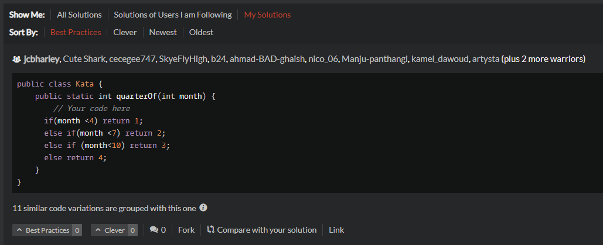

I was able to complete this solution within a couple minutes, and passed the tests. Upon submitting my successful solution I was presented with alternate solutions following best practises as voted on by others. I immediately realized that there are much more elegant ways to complete the problem that would be less redundant. My solution may not have used the best practises, but I am still very new to programming and I was happy with how fast I was able to accomplish the task presented to me. I did not find it nearly as challenging as I expected it to be going in. Overall, I am still learning about the options available to me in Java when attempting to solve problems (all I will say is CPS100 left a lot to be desired). I expect that most 8Kyu challenges are of a higher difficulty, and I plan to find out.

 

---

### **Week 3 Activities**

---

 

#### **Activity 0301:**

 

> **Question:** Choose a relatively popular app that you use regularly. Try to find [ideally] a video (or screenshots) of the app operating on a different platform than the one you typically use (i.e. if you use iOS, look for the Android version). If you have access to two devices with different platforms, even better - install the app on each platform and try it out. Alternatively, if your chosen app has a progressive web version that you can install on the same device with the native app, try that out instead. What differences do you note between platforms? Pay attention in particular to navigation and button placement. Write down your findings on your Process Portfolio.

 

**App in Focus:** Facebook

| Facebook iOS                            | Facebook Android                                |
| --------------------------------------- | ----------------------------------------------- |
| 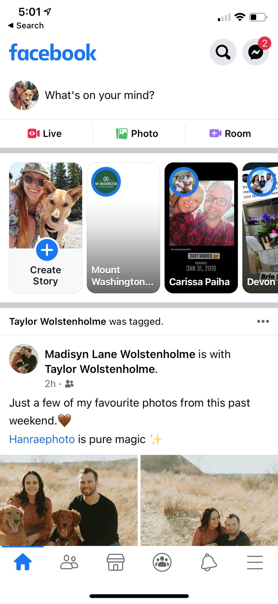 | 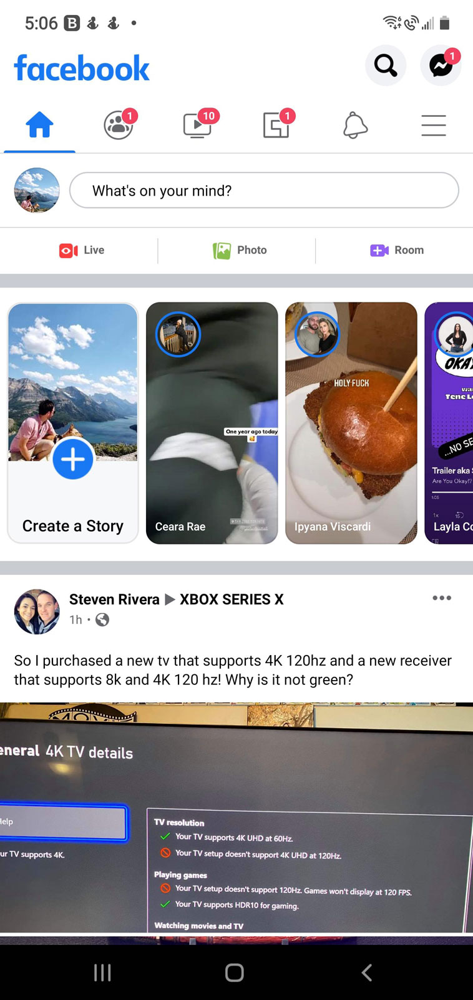 |

Examining the differences between the facebook application yields some expected results. Due to the different functionalities of the devices, they are presented with slightly different layouts.

The primary difference is in terms of navigation layout. As android devices have the 3 platform specific buttons integrated into the bottom of the screen, the in-app navigation has been relocated to the top of the activity screen. I beleive the reasoning behind this is to eliminate the possibility of accidentally hitting the android buttons while browsing between activities in the app itself. Additionally these buttons provide some in app functionality as well, such as using the back button to navigate to a previous activity screen within the app. The iOS version, due to not having these buttons has opted to place the navigation bar at the bottom of the screen. In app navigations can be done with a swipe gesture instead.

I can see benefits to either side. Having the ability to use the integrated back button on android is conveinent, though the iOS version does provide a nice "contained" look by bordering the bottom of the screen to avoid the run-off appearance present in the android version.

Either way, in my personal opinion, Android is king.

---

 

#### **Activity 0302:**

 

> **Question:** Visit either Android Developer Guides or Apple Developer Technologies. Scroll through to look for an article/documentation section that interests you. Read through any overview content and scan through some of the related content. Pay attention to the structure of the documentation (i.e. how the documentation is laid out, how the information is presented, etc.) Write a short summary of the section you looked at on your Process Portfolio and breifly describe what you learned about the documentation structure.

| Link To Documentation Reviewed: https://developer.android.com/training/animation/overview?hl=en |
| ----------------------------------------------------------------------------------------------- |
| 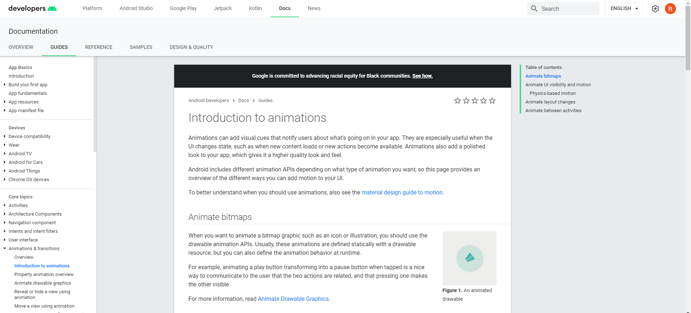                                                 |

While browsing the Android Developer Guides I was drawn to an article regarding animations. You can see the layout of this article in the photo above. The page is presented with an easily navigated menu along the left side of the screen detailing all of the possible articles to explore. On the right hand side of the screen, there is a table of contents pertaining to the information contained within the current article you are viewing. Additionally, throughout the page there are embedded links which reference other materials that may be of interest to you or provide additional context. It is also helpful that they provide visual aids to increase understanding of the content.

This documentation provided some interesting information regarding the use of animations in your application design. It outlined some use cases for animations in your application, and important considerations to take when creating them. When it comes to animations the document covers four main topics:

1. Animate bitmaps - This section provides suggestions for the proper animation of a bitmap graphic using drawable animation APIs.

2. Animate UI visibility and motion - This section indicates the importance of using subtle animations to help users understand UI changes and make the experience less jarring using physics based motion.

3. Animate layout changes - This section details using transition frameworks to animate layout changes within the current activity, such as a tap event on an item for more information.

4. Animate between activities - Lastly this section discusses using animations to transition between activity screens within your application.

---

### **Week 4 Activities**

---

 

#### **Activity 0401:**

 

> **Question:** Scroll through either pttrns.com or mobile-patterns.com (watch out for ads) and pick a pattern that is of interest to you (it can be one you’ve used before, or not). Consider the when and how the pattern should be used and write a short summary (a paragraph) that outlines why you think the pattern is valuable (similar to - but shorter than - the introductory summaries for each of the patterns presented in UX Design Patterns for Mobile Apps: Which and Why.

| Pattern                                      |
| -------------------------------------------- |
| 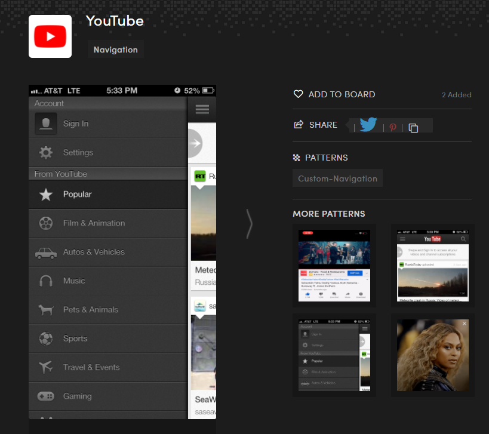 |

The above pattern presents a navigation menu that is much more usable for the mobile platform than standard nav bars. By hiding the navigation behind a navicon, you save space in your design and contain the navigation elements in an attractive list that can be hidden or revealed at will. This is a valuable tool when designing with usability in mind on the mobile platform. We learned about implementing this design in our HTML and CSS course when discussing responsive design. This can be implemented with media queries, only activating when viewing on certain screen sizes. It allows a website/webapp to be responsive to their users devices. Overall, it is a great design choice that should always be implemented into the mobile version of websites or in webapps that require a long navigation list.

---

 

#### **Activity 0403:**

 

> **Question:** Visit CodeWars.com and attempt at least two katas. Ideally you should finish both - so choose something that is within your level of programming expertise.

**Kata #1:**

| Description:                                         |
| ---------------------------------------------------- |
| 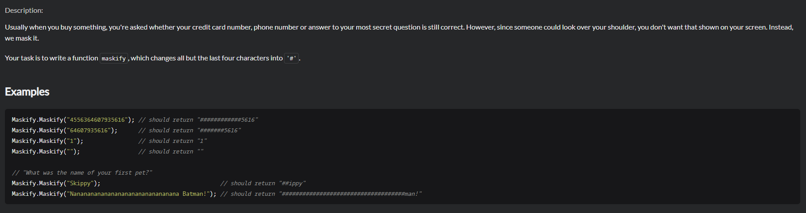 |

| Solution:                                      |
| ---------------------------------------------- |
| 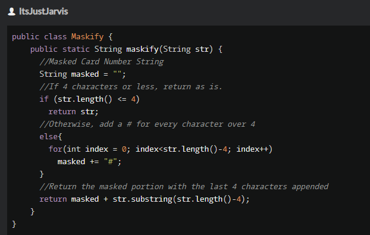 |

**Kata #2:**

| Description:                                         |
| ---------------------------------------------------- |
| 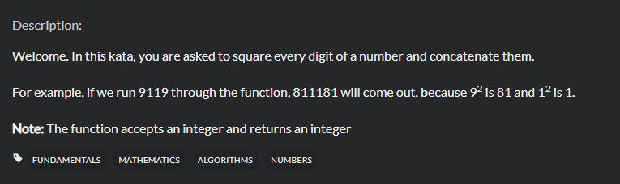 |

| Solution:                                      |
| ---------------------------------------------- |
| 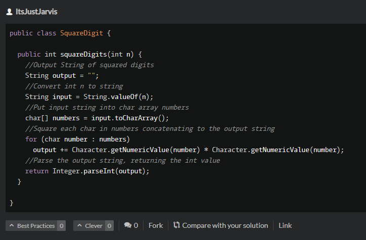 |

---

### **Week 5 Activities**

---

 

#### **Activity 0501:**

 

> **Question:** Write a summary that outline the main similarities and differences between MVC, MVP and MVVM. You can use a list to make the distinctions clear, but you should write at least a brief paragraph describing when you might choose to use one over the other.

---

MVC (Model View Controller):

- M: The Model is the data and business logic. It is not tied to the view or controller.
- V: The View is the representation of the Model. It renders the UI and communicates user interactions to the controller. It has no knowledge of the model, state, or what transpires from the interaction taking place.
- C: The Controller communicates between the View and Model. As data is changed in the model, the view is appropriately updated.

MVC is great for separating the Model (data) and the View (visual representation). However it does present some concerns when considering the Controller. In larger scale projects it can become unwieldy and hard to maintain. Testing concerns arrise as well since the controller is so closely tied to the Android APIs.

---

MVP (Model View Presenter):

- M: The Model is still the data, and in this way MVC and MVP are similar.
- V: The View is different in the sense that the activity is considered part of the view. Implementation of a view interface is good practise to handle code from the Presenter.
- P: The presenter is essentially a controller, but has no direct relation to the View. Rather it commmunicates through the use of an interface.

MVP is much cleaner. You can perform tests more easily as it is not tied to the Android specific APIs or views, and can work with any view that implements the view interface. Similar to MVC the presenter can take on more business logic as the project grows, which can prove to make maintainence difficult in larger projects.

---

MVVM:

- M: The Model remains the same as the previous two examples.
- V: The View works with variable and actions presented by the ViewModel.
- VM: The ViewModel encapsulates the model, and presents observable data needed by the view. It also allows the view to pass events to the model, while maintaining separation from the view.

MVVM removes dependency on the view. When testing, the only thing of concern is setting variables accordingly when the model data changes.

---

Overall, MVP and MVVM allow for a more modular approach. They increase the separation of concerns, and reduce dependancies throughout your code. However, they are also much more complicated. For smaller projects MVP may be adequate for your needs, but as things grow it can increase your concerns and damage reusability.

---

 

#### **Activity 0502:**

 

> **Question:** Consider a recent (or current) programming project that uses global variables, or that contains 'coupled' code (i.e. method chaining, or multiple responsibilities). Consider what you would need to do to fix the code and write a brief strategy for your approach (you do not need to write new code here, but consider instead what you might do to 'decouple' your code).

In CPS-100 I had written a program representing a gameroom experience, where the player would select from a series of games-of-chance and compete against a computer player. The player could continue selecting a different game, or play additional rounds until they decided to quit. The way I had written the program initially, I was using global variables for the player name/scoring details. I wanted to have the name be consistent across all the games, and to be able to keep track of the scoring details throughout the entire session until the player decided to quit playing. I had no knowledge on how to properly implement this using accessors and mutators to make these variables private, and little direction as to how to do this properly. I struggled to figure out how to implement a solution that would be properly de-coupled. While troubleshooting my code, I would make an adjustment and that would cause a domino effect essentially breaking 5 other things. Looking back, with the knowledge I have gained in Java programming I can see some viable solutions to this issue. Had I started my coding by establishing a separation of concerns, and using an MVC architecture for example I would have been able to separate the elements of my program from the start. I could ensure that I had a properly structured player class to handle all data related to the player, and use getters and setters to access the information I needed through a controller. In turn I could have the controller use that data and update the view, which could represent the scoreboard. This way, my code would be much more organized and allow for easier adjustments/improvements without risking breaking something else in the process.

---

## **Part 2:**

---

### **Week 8 Activities**

---

 

#### **Activity 0801:**

 

> **Question:** Write a summary that outline the main similarities and differences in MVI as compared to the other three patterns (MVC, MVP and MVVM). You can use a list to make the distinctions clear, but you should write at least a brief paragraph describing when you might choose to use one over the other.

MVI is a newer architecture pattern for Android development. Similar in certain ways to previously discussed architectures, but with some significant differences. MVI has a more reactive design, and Models are immutable.

**Components of MVI:**

- **Model:** The model in MVI architecture holds data like other arhitectures, however it is also used to represent State. This means you dont have to manage the state in multiple places such as the View and Presenter/Controller.
- **View:** Like MVP the view is defined by an interface. In MVI however the view uses observable intents to respond to user actions instead of method names.
- **Intent:** In MVI, intents are used along side reducers to create new States based on previous and current states.

MVI is a great for creating scalable and easily maintainable apps. Data flow is carried out in a singular cyclical direction with reliable and immutable Model data. However, it is more difficult to comprehend and may be a bit out of reach for beginners initially.

---

 

#### **Activity 0802:**

 

> **Question:** After reading through Usability Matters - Ch. 14 consider an app that you use frequently (on any platform). What resources do you think are most critical to your app's functionality? What choices do you expect the developers of the app made to ensure that the app is performant?

Google maps is an app that I use frequently, and one that inherently requires resources to function properly. Most critically, I would say that it requires location resources, and access to databases containing up to date traffic/satellite data. This data is critical to it's functionality and I'm sure is very resource intensive. I expect that the developers had to make some significant choices in order to ensure proper performance while balancing power and resource drain on the device. Some of these choices probably included:

- Using approximate location rather than specific GPS locations when not using the directions function
- Cacheing visual map representations to reduce load
- Only providing traffic information when required
- Allowing the option to download maps/information to work in offline mode

---

### **Week 9 Activities**

---

 

#### **Activity 0902:**

 

> **Question:** After reading Pragmatic Programmer - Debugging consider the three debugging strategies Logging and/or Tracing, Rubber Ducking, and Process of Elimination in the context of a debugging error from one of your own recent coding projects. Did you use a strategy similar to one of these three? Did you take a different approach? What can you learn from these strategies that you will take forward to future projects? Summarize your thoughts on your process portfolio.

In our recent DGL114 Assignment 2, I was experiencing an issue when receiving data from an Intent. For some reason, the information being passed to my activity was not giving me the result I expected. Being new to Android development and programming in general, I felt a bit lost and decided to rely on Logging/Tracing to figure out my issue. This is a skill we had discussed in many of our courses thus far in the DGL program, and a simple one to implement to find a solution. I set up a few Log.d messages to track the values in the variables I needed. Doing this along side some online research allowed me to discover my issue fairly quickly. I realized that the integer being returned was the reference number rather than the actual string value I was expecting. A quick fix was to implement the getResources().getInteger() methods to return the value of the resource. Reading through these different debugging methods re-affirms the importance of the skills we are being taught in this program. Being new to this area of study can be frustrating and defeating at times, but I have learned to step back and take a wider view of the problem and try to approach it with an open mindstate.

---

 

#### **Activity 0903:**

 

> **Question:** Consider the four step process outlined in the Debugging (MIT OCW 6.005) reading. Which of these four steps have you consciously used before? Consider bugs you've solved before: Is there one step that you feel you've done particularly well? Is there one step that you feel you could improve on? Might there be situations where this four step process won't work? Summarize your thoughts on your process portfolio.

Considering the process outlined in the article, I can definitely see connections to the way I have debugged code in some of my work. When approaching errors within my code I have tried to use techniques taught in previous courses. I usually experiment with different test cases, to observe any change in results. I've also implemented other experimental approaches such as testing internal states/values with print statements or breakpoints. I feel like I have done pretty well at that experimental stage in the process. Something I could improve on is my process of consistently repeating tests. I feel that I am in such a rush to complete assignments that the second I find a viable solution that fixes the problem at hand, I consider my code finalized and ready for submission. This may result in other issues going unnoticed. Either way, the article definitely outlines some useful information, and I could see this process working for most cases both within and outside the world of programming.

---

### **Week 10 Activities**

---

 

#### **Activity 1001:**

 

> **Question:** Have you ever programmed by coincidence? Can you recall a time where you have been stuck programming by coincidence? Which of the points in the 'How to Program Deliberately' bulleted list in the Pragmatic Programmer - Programming by Coincidence stood out to you? Were you surprised by any of the points? Which one do you think would be the most valuable for you to adopt in the future? Summarize your thoughts on your process portfolio.

Being new to programming, I feel that there have been many times when I have programmed by coincidence. To be perfectly honest I don't always understand what I am doing with my code, not for a lack of wanting to but for the simple fact that I am new to all of this. Programming has been something that I have done quite well at overall (if you consider my marks), but it is also something that I struggle to understand constantly. Basically the entire semester of CPS100 I found myself programming by coincidence/example, implementing things that I had seen in one place or another and did not fully understand. I would adjust coding patterns based on my needs and the limited understanding I had and achieve positive results. I do feel that along the way I gained a better understanding about the concepts, but I still don't fully understand what is happening behind the scenes. I feel that alot of that attributes to poor instruction methods for an introductory course if I am being honest. I have a long way to go, but I will continue to do my best to adapt to the situation which is something I pride myself on. As far as points that stood out within the reading:

- Don’t be a slave to history. Don’t let existing code dictate future code. All code can be replaced if it is no longer appropriate. Even within one program, don’t let what you’ve already done constrain what you do next—be ready to refactor (see Topic 40, Refactoring, on page 209). This decision may impact the project schedule. The assumption is that the impact will be less than the cost of not making the change.

The above point is something that really stuck with me. I think this is an excellent point to consider when coding, as well as in life, and I plan to keep it in the forefront of my mind when programming going forward. There is always an argument to adjust for new opportunities, rather than remain comfortable with the previous methods.

---

 

#### **Activity 1002:**

 

> **Question:** Last week we looked at debugging methods. This week our Avoiding Debugging (MIT OCW 6.005) reading asks us to plan to avoid debugging as much as possible. Asserts are a typical defensive programming technique. Consider a recent problem you've had in your own code: Where might an assert have helped you find the source of a bug more quickly? Are there situations where you might typically use asserts in future programming tasks? Summarize your thoughts on your process portfolio.

Unknowingly I have used asserts many times before in my programming assignments by doing conditional checks to ensure values meet requirements or are not null. Recently, I encountered an issue with one of my DGL114 assignments where I needed to ensure a value was not null to avoid a possible null pointer exception. This definitely assisted me in debugging my code when I was not getting the results that I expected. I definitely plan to continue using asserts in this conditional check form in my future programming tasks. They seem particularly useful in ensuring that accessed values fall within an acceptable boundry to avoid exceptions and errors, such as when getting input values from text entry or returned values from alternate methods.

---

### **Week 11 Activities**

---

 

#### **Activity 1102:**

 

> **Question:** We use a number of different editors and IDEs across the DGL program, the most important of those being VS Code, Android Studio and Xcode. Choose one of these IDEs/editors and find either the documentation for the IDE, or a series of tutorials that describe features and editor tools (VS Code has a great series of articles, for example). Find at least one IDE/editor feature that you previously knew nothing about and summarize its use and purpose on your process portfolio.

After reviewing the articles suggested for VSCode, I discovered some useful tips and tricks that I had no previous knowledge about. To be honest it is a little embarassing that I was completely unaware of the command palette shortcut that brings up all available keyboard shortcuts for the current context. This is honestly such a great tool that will help me remember these shortcuts and keep my hands on the keyboard. By pressing ctrl+shift+P you pull up a list of commands available to you, and their repsective shortcut keys. I will definitely be using this regularly going forward to speed up my coding when building websites and writing javascript in VSCode. It's the little things that go a long way.

---

 

#### **Activity 1103:**

 

> **Question:** Visit CodeWars.com and attempt at least two katas. Ideally you should finish both - so choose something that is within your level of programming expertise. For this activity make sure that you focus on writing clean code and use good naming conventions for all name bindings.

**Kata #1:**

| Description:                                                |
| ----------------------------------------------------------- |
| 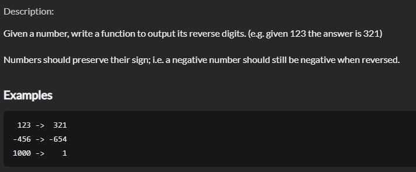 |

| Solution:                                             |
| ----------------------------------------------------- |
| 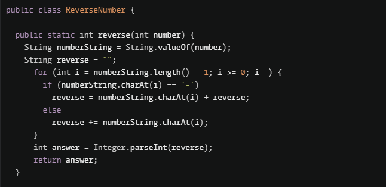 |

**Kata #2:**

| Description:                                        |
| --------------------------------------------------- |
| 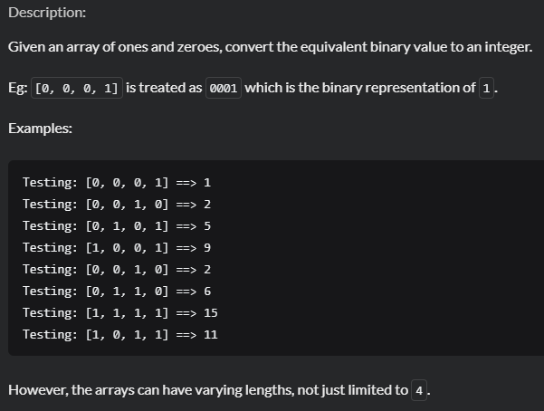 |

| Solution:                                     |
| --------------------------------------------- |
| 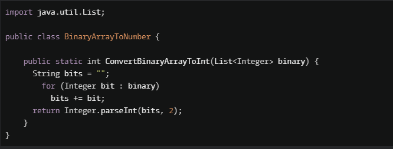 |
